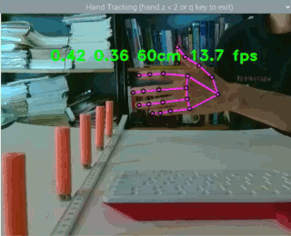
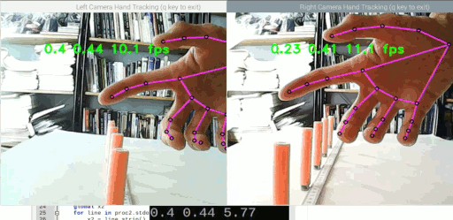

# Raspberry-Pi-MediaPipe-Experiment
Exploring MediaPipe on Raspberry Pi 4 

The first two numbers are normalized (0.0-1.0) xy positions of a finger tip. The third number is an approximated z position (cm) of the hand (assuming horizontal fingers) from the camera. The fourth number is MediaPipe hand tracking at ~14fps using max_num_hands=1 (~8fps for max_num_hands=2). 

## Hardware

Raspberry Pi 4 Model B (tested) 

Raspberry Pi Camera 1.3 (tested) 

## Software

Raspberry Pi OS with desktop 
Release date: May 7th 2021 
Kernel version: 5.10 
Size: 1,180MB 

Raspberry Pi is up to date:

sudo apt-get update 
sudo apt-get upgrade 
sudo reboot 

Next four lines are from https://pypi.org/project/mediapipe-rpi4/

sudo apt-get install ffmpeg python3-opencv 
sudo apt-get install libxcb-shm0 libcdio-paranoia-dev libsdl2-2.0-0 libxv1  libtheora0 libva-drm2 libva-x11-2 libvdpau1 libharfbuzz0b 
sudo apt-get install libbluray2 libatlas-base-dev libhdf5-103 libgtk-3-0 libdc1394-22 libopenexr23 

sudo pip3 install mediapipe-rpi4 

sudo apt-get install espeak 
espeak hello (check if working) 

Numpy and Pygame are already in Pi OS. 

## Experiment 1 

Python code to track hand, compute length of middle finger, approximate z distance (cm) from Pi camera, vary an audio sine wave as a function of z: 

<pre>
import mediapipe as mp
import cv2
import pygame
import numpy
import threading
import time
import os

x1 = 3.0
y1 = 3.0
x2 = 3.0
z = 60.0        # initial value distance (cm) from camera to prevent thread from exit at start
fps = 0.0

sampling = 44100
pygame.mixer.init(sampling, -16, 1)
pygame.init()
        
def sound1():

  while True:

        if z < 20.0:
           break

        z_hold = z   # mediapipe hand tracking ~8Hz, python thread generates a sine wave as a function of z every 1 seconds 

        data = numpy.sin(2 * numpy.pi * z_hold * numpy.arange(sampling) * 10 / sampling).astype(numpy.float16)
        sound = pygame.mixer.Sound(data)

        sound.play().set_volume(0.05)   # set volume low
        
        pygame.time.delay(1000)
        
        string = "espeak " + str(numpy.round(z_hold,1))
        os.system(string)

thread1 = threading.Thread(target=sound1)
thread1.start()

mp_drawing = mp.solutions.drawing_utils
mp_hands = mp.solutions.hands

cap = cv2.VideoCapture(0)

with mp_hands.Hands(min_detection_confidence=0.8, min_tracking_confidence=0.5, max_num_hands=1) as hands:

    while cap.isOpened():

        time1 = time.time()

        ret, frame = cap.read()
        
        image = cv2.cvtColor(frame, cv2.COLOR_BGR2RGB)
        
        image = cv2.flip(image, 1)
        
        image.flags.writeable = False
        
        results = hands.process(image)   # mediapipe analyzes a frame
        
        image.flags.writeable = True
        
        image = cv2.cvtColor(image, cv2.COLOR_RGB2BGR)
        
        if results.multi_hand_landmarks:
            for num, hand in enumerate(results.multi_hand_landmarks):
                    
                mp_drawing.draw_landmarks(image, hand, mp_hands.HAND_CONNECTIONS, 
                                        mp_drawing.DrawingSpec(color=(0, 0, 0), thickness=2, circle_radius=4),
                                        mp_drawing.DrawingSpec(color=(250, 50, 250), thickness=2, circle_radius=2)
                                         )
                                         
            x1 = hand.landmark[mp_hands.HandLandmark.MIDDLE_FINGER_TIP].x
            y1 = hand.landmark[mp_hands.HandLandmark.MIDDLE_FINGER_TIP].y
            x2 = hand.landmark[mp_hands.HandLandmark.MIDDLE_FINGER_MCP].x
            
            z = int(numpy.round(10/(x2-x1+1e-09)))            # assuming middle finger ~horizontal in front of camera
                                                              # 1e-09 prevents zero division 1/0 for improbable x2 = x1 = 0
        time2 = time.time()
        fps = 1/(time2-time1)
        time1 = time2

        string2 = str(numpy.round(x1,2)) + " " + str(numpy.round(y1,2)) + " " + str(z) + "cm" + " " + str(numpy.round(fps,1))+" fps"

        image2 = cv2.putText(
                img = image,
                text = string2,
                org = (100, 100),
                fontFace = cv2.FONT_HERSHEY_DUPLEX,
                fontScale = 1.0,
                color = (0, 255, 0),
                thickness = 2
                )
                                
        cv2.imshow('Hand Tracking (hand z < 20cm or q key to exit)', image2)

        if cv2.waitKey(10) & 0xFF == ord('q'):
            break

        if  z < 20.0:
            break

z = 1.0         # thread exits

cap.release()
cv2.destroyAllWindows()

os.system("espeak 'stopping program'")

</pre>

Call python script "rpi4-mediapipe-experiment.py". 

python3 rpi4-mediapipe-experiment.py 

## Exploring how Experiment 1 works

## Experiment 2 - Depth perception

Explores depth perception using MediaPipe with two cameras. 

Two identical usb webcams separated ~6cm to mimic human eyes. In each opencv window, MediaPipe hand tracking gives XY positions of finger tip and computes Z positions. A small terminal window on the bottom prints (x,y,z) of finger tip from left view. Z positions are not scaled properly and dimensionless. Experiment works as Z is increasing as hand is moving away from both cameras. 

A Pi camera and a usb webcam should work but most likely have different field of views so different computed Z positions. Not critical since this is an experiment to learn to compute Z from two different views. 

Unlike Experiment 1, it is not dependent on a finger being horizontal to compute Z (but required two cameras). 

Here is a python script for a camera. 

<pre>
import numpy
import mediapipe
import cv2
import time
from sys import stdout

x_index = 0
y_index = 0

mp_drawing = mediapipe.solutions.drawing_utils
mp_hands = mediapipe.solutions.hands

cap = cv2.VideoCapture(0)

with mp_hands.Hands(min_detection_confidence=0.8, min_tracking_confidence=0.5, max_num_hands=1) as hands:

    while cap.isOpened():

        time1 = time.time()

        ret, frame = cap.read()
        
        image = cv2.cvtColor(frame, cv2.COLOR_BGR2RGB)
        
        image = cv2.flip(image, 1)
        
        image.flags.writeable = False

        results = hands.process(image)  # mediapipe analyzes image
        
        image.flags.writeable = True
        
        image = cv2.cvtColor(image, cv2.COLOR_RGB2BGR)
        
        if results.multi_hand_landmarks:
            for num, hand in enumerate(results.multi_hand_landmarks):
                    
                mp_drawing.draw_landmarks(image, hand, mp_hands.HAND_CONNECTIONS, 
                                        mp_drawing.DrawingSpec(color=(0, 0, 0), thickness=2, circle_radius=4),
                                        mp_drawing.DrawingSpec(color=(250, 50, 250), thickness=2, circle_radius=2)
                                         )

            x_index = hand.landmark[mp_hands.HandLandmark.INDEX_FINGER_TIP].x
            y_index = hand.landmark[mp_hands.HandLandmark.INDEX_FINGER_TIP].y
         
        print(x_index,y_index)
        stdout.flush()          # keep pipe in next script moving

        time2 = time.time()
        fps = 1/(time2-time1)
        time1 = time2

        string = str(numpy.round(x_index,2)) + " " + str(numpy.round(y_index,2)) + " " + str(numpy.round(fps,1))+" fps"
        
        image = cv2.putText(
                img = image,
                text = string,
                org = (100, 100),
                fontFace = cv2.FONT_HERSHEY_DUPLEX,
                fontScale = 1.0,
                color = (0, 255, 0),
                thickness = 2
                )
                                
        cv2.imshow('Hand Tracking (q key to exit)', image)

        if cv2.waitKey(10) & 0xFF == ord('q'):
            break

cap.release()
cv2.destroyAllWindows()
</pre>

Name script "left-eye.py". Run "python3 left-eye.py" in a terminal. Let that camera be the left eye. 

Next "cp left-eye.py right-eye.py" and change "cap = cv2.VideoCapture(2)". (not sure what happen to 1?) Run "python3 right-eye.py" in another terminal. Let that camera be the right eye. 

If working, press key "q" in opencv window to exit scripts. The next script will run both scripts and compute Z positions from XY positions. 

<pre>
import subprocess
import threading
import time
import numpy

x1 = "2.0"
x2 = "1.0"
z = 0.0

proc = subprocess.Popen(["python3","left_eye.py"],stdout=subprocess.PIPE, text=True)

proc2 = subprocess.Popen(["python3","right_eye.py"],stdout=subprocess.PIPE, text=True)

def data1():
	global x1
	for line in proc.stdout:
		x1 = line.strip()
		x1 = x1.split()

def data2():
	global x2
	for line in proc2.stdout:
		x2 = line.strip()
		x2 = x2.split()

		if type(x1) == list:
			z = numpy.abs(1/(float(x2[0])-float(x1[0])+1e-09))		
			print(round(float(x1[0]),2),round(float(x1[1]),2),round(z,2))

thread1 = threading.Thread(target=data1)
thread1.start()

thread2 = threading.Thread(target=data2)
thread2.start()	
</pre>

## Credits

https://pypi.org/project/mediapipe-rpi4/

https://google.github.io/mediapipe/

https://google.github.io/mediapipe/solutions/hands

## References

Hand landmarks (eg. coding hand.landmark[mp_hands.HandLandmark.MIDDLE_FINGER_TIP].x) 

https://google.github.io/mediapipe/images/mobile/hand_landmarks.png

Nicholas Renotte's excellent introduction to python mediapipe hand tracking 

https://www.youtube.com/watch?v=vQZ4IvB07ec

Pygame mixer is used for sound synthesis 

https://www.pygame.org/docs/ref/mixer.html

What is Pygame? 

https://www.pygame.org/news

Experiment 2 is based on the same concept "Basics" in OpenCV depthmap tutorial but using one x and x' for a finger tip and not computing a depth map from left and right images. 

https://docs.opencv.org/master/dd/d53/tutorial_py_depthmap.html

 Copyright (c) 2021 Hartwell Fong
